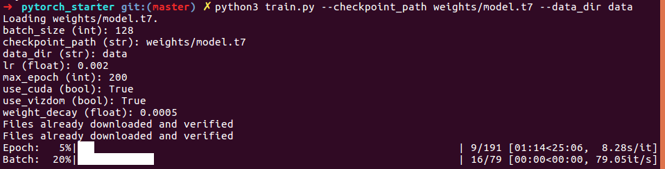
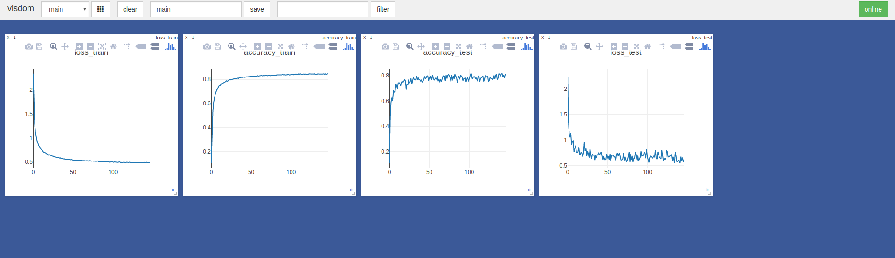

## PyTorch Starter Kit

### Installation

Install [PyTorch](pytorch.org).

```
pip3 install -r requirements.txt
```

### Training

Open up two terminals, one will be used to host the visdom server that handles visualizations.

To get Visdom live, run the following

```
python3 -m visdom.server
```

To start the training process,

```
python3 train.py --checkpoint_path weights/model.t7 --data_dir data/
```

Any parameter in `parameters.py` can be changed optionally by adding a command line flag to make batch jobs on clusters easier.


For example,

```
python3 train.py --checkpoint_path weights/model.t7 --data_dir data/ --batch_size 32 --use_vizdom 0
```

### Screenshots



